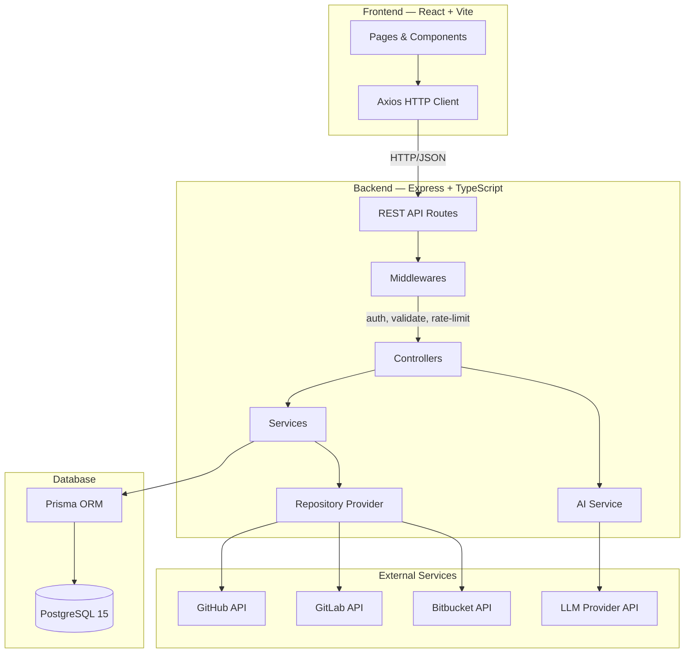
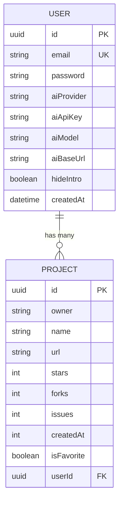
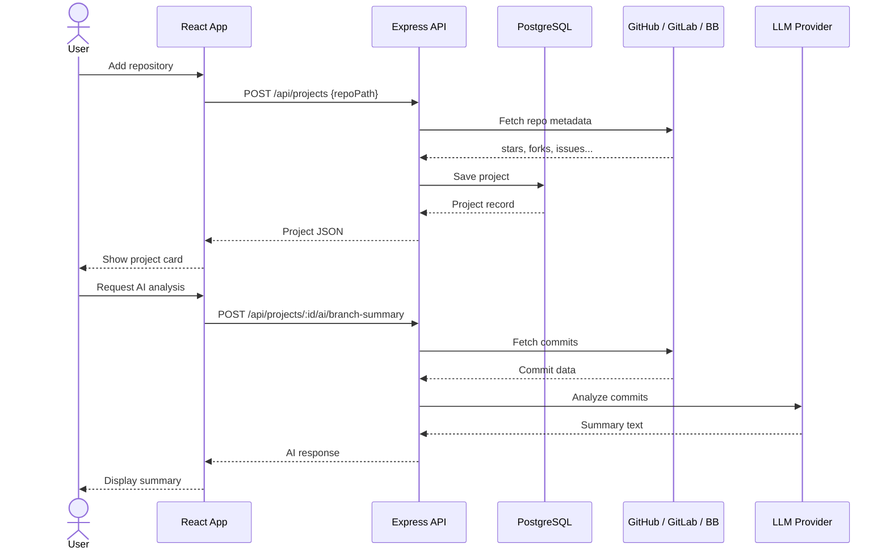

<div align="center">

# Repository Projects CRM

### Unified dashboard for managing GitHub, GitLab & Bitbucket repositories with AI-powered insights

[](https://nodejs.org/)
[](https://react.dev/)
[](https://www.typescriptlang.org/)
[](https://www.postgresql.org/)
[](https://www.prisma.io/)
[](https://docs.docker.com/compose/)
[](LICENSE)

<br/>

> Track stars, forks, issues, branches and pull requests across all your repositories.
> Get AI summaries, code reviews and fix suggestions — all from one place.

<br/>

</div>

---

## Features

### Repository Management

- **Multi-platform support** — GitHub, GitLab, Bitbucket
- **Flexible input** — paste a full URL or use shorthand (`owner/repo`, `gitlab:group/repo`, `bitbucket:workspace/repo`)
- **Auto-fetched metrics** — stars, forks, open issues, creation date
- **CRUD operations** — add, view, update, delete tracked repositories
- **Favorites** — mark repositories as favorites for quick access

### Repository Insights

- **Branches** — all branches with last commit info, sortable by date
- **Issues** — full issue list, sortable by newest/oldest
- **Pull Requests** — complete PR tracking, sortable by update date

### AI Analysis

- **Branch Summary** — analyze recent commits on any branch
- **Issues Overview** — AI-generated summary of latest issues with key themes
- **PR Overview** — AI summary of recent PRs with risk assessment
- **Code Review** — AI-powered review of recent commits with findings
- **Code Fix** — AI suggests improvements for code snippets

### AI Providers

| Provider      | Model (default)                |
| ------------- | ------------------------------ |
| OpenAI        | `gpt-4o-mini`                  |
| Google Gemini | `gemini-2.0-flash`             |
| DeepSeek      | `deepseek-chat`                |
| OpenRouter    | `openai/gpt-4o-mini`           |
| Custom        | Any OpenAI-compatible endpoint |

### UI/UX

- **Theme switching** — System / Light / Dark modes
- **Onboarding guide** — interactive intro for new users
- **Error boundary** — graceful error handling with recovery
- **Responsive design** — Bootstrap 5
- **Pagination** — paginated project list

---

## Architecture



---

## Database Schema



---

## Tech Stack

| Layer             | Technology                                                                        |
| ----------------- | --------------------------------------------------------------------------------- |
| **Frontend**      | React 19, TypeScript, Vite 7, Bootstrap 5, React Router 7, React Hook Form, Axios |
| **Backend**       | Node.js, Express 5, TypeScript, Prisma 6 ORM                                      |
| **Database**      | PostgreSQL 15                                                                     |
| **Auth**          | JWT + bcrypt                                                                      |
| **AI**            | OpenAI-compatible API (multi-provider)                                            |
| **Validation**    | Zod                                                                               |
| **API Docs**      | Swagger / OpenAPI (swagger-jsdoc + swagger-ui-express)                            |
| **Logging**       | Pino + pino-http                                                                  |
| **Rate Limiting** | express-rate-limit                                                                |
| **Testing**       | Vitest + Testing Library (client), Jest 30 + Supertest (server), Playwright (e2e) |
| **Docs**          | Storybook 8                                                                       |
| **Code Quality**  | Prettier, Husky, lint-staged, ESLint                                              |
| **DevOps**        | Docker + Docker Compose                                                           |

---

## API Reference

### Auth

| Method | Endpoint           | Description         |
| ------ | ------------------ | ------------------- |
| `POST` | `/api/auth/signup` | Register a new user |
| `POST` | `/api/auth/login`  | Login, returns JWT  |

### User

| Method | Endpoint             | Description                        |
| ------ | -------------------- | ---------------------------------- |
| `GET`  | `/api/user/settings` | Get user settings                  |
| `PUT`  | `/api/user/settings` | Update AI provider, model, API key |

### Projects

| Method   | Endpoint                     | Description                   |
| -------- | ---------------------------- | ----------------------------- |
| `GET`    | `/api/projects`              | List projects (paginated)     |
| `POST`   | `/api/projects`              | Add a repository              |
| `GET`    | `/api/projects/:id/details`  | Full project details          |
| `PATCH`  | `/api/projects/:id/update`   | Refresh project data from API |
| `PATCH`  | `/api/projects/:id/favorite` | Toggle favorite status        |
| `DELETE` | `/api/projects/:id`          | Delete a project              |

### Insights

| Method | Endpoint                     | Description                    |
| ------ | ---------------------------- | ------------------------------ |
| `GET`  | `/api/projects/:id/branches` | List branches with last commit |
| `GET`  | `/api/projects/:id/issues`   | List issues                    |
| `GET`  | `/api/projects/:id/pulls`    | List pull requests             |

### AI Analysis

| Method | Endpoint                              | Description                      |
| ------ | ------------------------------------- | -------------------------------- |
| `POST` | `/api/projects/:id/ai/branch-summary` | AI summary of branch commits     |
| `POST` | `/api/projects/:id/ai/issues-summary` | AI overview of latest issues     |
| `POST` | `/api/projects/:id/ai/pulls-summary`  | AI overview of latest PRs        |
| `POST` | `/api/projects/:id/ai/code-review`    | AI code review of recent commits |
| `POST` | `/api/projects/:id/ai/code-fix`       | AI fix suggestions for code      |

> All endpoints except auth require a `Bearer` JWT token in the `Authorization` header.
> AI endpoints are rate-limited. API docs available at `/api-docs` (Swagger UI).

---

## Quick Start

### Docker (recommended)

```bash
git clone https://github.com/yourusername/repository-projects-crm.git
cd repository-projects-crm
cp .env.example .env   # edit .env with your values
docker compose up --build
```

The app will be available at:

- **Frontend:** http://localhost:5173
- **Backend:** http://localhost:5001
- **API Docs:** http://localhost:5001/api-docs

### Local Development

**Prerequisites:** Node.js 22+, PostgreSQL 15+

```bash
# Clone
git clone https://github.com/yourusername/repository-projects-crm.git
cd repository-projects-crm

# Backend
cd server
npm install
npx prisma migrate dev
npm run dev

# Frontend (new terminal)
cd client
npm install
npm run dev
```

---

## Environment Variables

```env
# Database
POSTGRES_USER=postgres
POSTGRES_PASSWORD=CHANGE_ME
POSTGRES_DB=github_crm

# Ports
PORT_BACKEND=5001
PORT_FRONTEND=5173

# Auth
JWT_SECRET=CHANGE_ME_generate_with_openssl_rand_hex_32

# Frontend
VITE_API_URL=http://localhost:5001/api

# CORS (comma-separated for multiple origins)
CORS_ORIGIN=http://localhost:5173

# Repository tokens (optional, recommended)
GITHUB_TOKEN=your_github_token
GITLAB_TOKEN=your_gitlab_token
BITBUCKET_USERNAME=your_bitbucket_username
BITBUCKET_APP_PASSWORD=your_bitbucket_app_password

# AI (required for AI features)
OPENAI_API_KEY=your_openai_api_key
OPENAI_MODEL=gpt-4o-mini          # optional
```

---

## Project Structure

```
repository-projects-crm/
├── client/                          # React frontend
│   ├── src/
│   │   ├── components/              # UI components (barrel pattern)
│   │   │   ├── AddProjectButton/    # Add repository modal
│   │   │   ├── AppErrorBoundary/    # Error boundary with recovery
│   │   │   ├── DeleteProjectButton/ # Delete confirmation
│   │   │   ├── IntroGuide/          # Onboarding wizard
│   │   │   ├── LogoutButton/        # Logout action
│   │   │   ├── ProjectCard/         # Repository card with insights
│   │   │   ├── SettingsButton/      # AI provider settings
│   │   │   ├── UpdateProjectButton/ # Refresh project data
│   │   │   └── index.ts             # Barrel export
│   │   ├── pages/                   # Login, Signup, Projects
│   │   │   └── __stories__/         # Page-level Storybook stories
│   │   ├── services/                # Axios API client
│   │   ├── styles/                  # CSS modules
│   │   ├── types/                   # TypeScript interfaces
│   │   └── __tests__/               # Unit tests (Vitest)
│   └── .storybook/                  # Storybook config
│
├── server/                          # Express backend
│   ├── src/
│   │   ├── config/                  # env, logger (Pino), swagger
│   │   ├── constants/               # AI prompts, project configs
│   │   ├── controllers/             # Request handlers
│   │   ├── middlewares/             # Auth, error, rate-limit, validate
│   │   ├── routes/                  # API route definitions
│   │   ├── schemas/                 # Zod validation schemas
│   │   ├── services/                # Business logic & AI service
│   │   ├── utils/                   # JWT, Prisma, AI client, providers, errors
│   │   └── __tests__/               # Unit & integration tests (Jest)
│   └── prisma/                      # DB schema & migrations
│
├── e2e/                             # Playwright E2E tests
├── docker-compose.yml               # Multi-container setup
└── .env.example                     # Environment template
```

---

## Testing

```bash
# Frontend unit tests
cd client && npm test

# Backend unit tests
cd server && npm test

# E2E tests
cd e2e && npx playwright test

# Storybook
cd client && npm run storybook
```

---

## Request Flow



---

<div align="center">

**Built with TypeScript, powered by AI**

</div>
